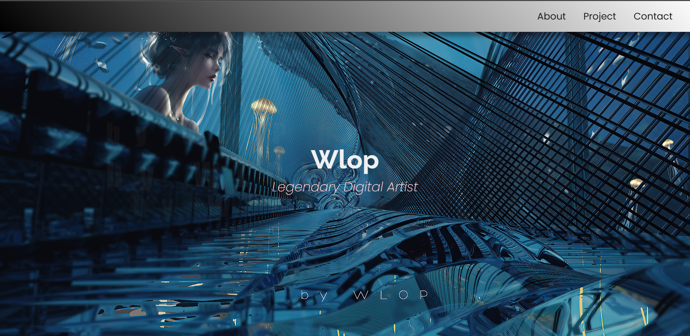

I have finished my study camp on <a href="https://www.freecodecamp.org/" style>FreeCodeCamp.org</a> 
and now, I have completed Learn CSS by building Personal Portofolio <a href="https://www.freecodecamp.org/learn/2022/responsive-web-design/#build-a-personal-portfolio-webpage-project" style>#FreeCodeCamp</a>

